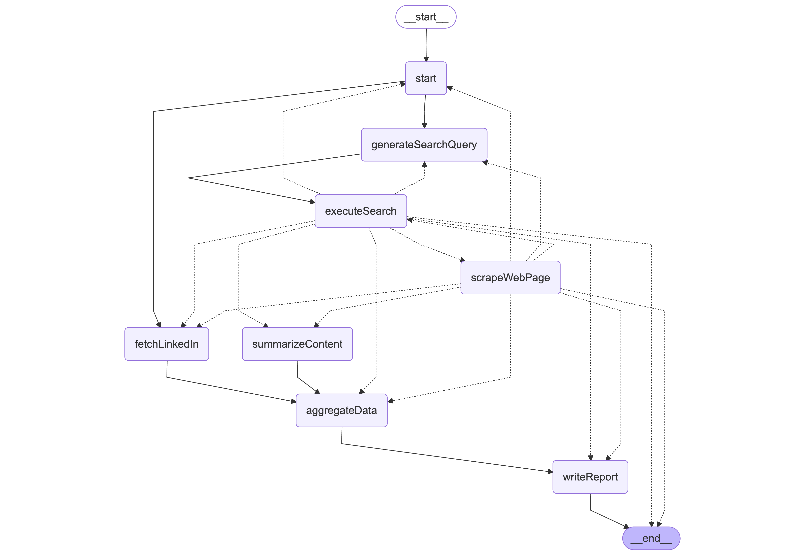

<div align="center">

# PeopleHub

### AI-Powered LinkedIn Intelligence Platform

Open-source people search engine with natural language queries, intelligent caching, and AI-powered research reports.

[Features](#-features) • [Quick Start](#-quick-start) • [Tech Stack](#-tech-stack) • [How It Works](#-how-it-works)

</div>

---

## 🎯 What is PeopleHub?

PeopleHub solves a common problem: **finding and researching professionals is either slow (manual LinkedIn searching) or expensive (premium tools charging $5+ per profile)**.

Instead of spending hours manually searching LinkedIn and taking notes, just type what you're looking for in plain English:

- "10 AI engineers in Israel"
- "Product managers in San Francisco with startup experience"
- "Elon Musk"

PeopleHub combines Google Gemini 2.0 for intelligent query parsing, Bright Data APIs for LinkedIn scraping, and LangGraph for automated research workflows.

## ✨ Features

### 🗣️ Natural Language Search
Search for professionals using plain English. No complex filters or Boolean operators needed.

**Example queries:**
- "5 AI Engineers in Israel"
- "Software engineers at Google"
- "Product managers in San Francisco with startup experience"

### ⚡ Smart Multi-Tier Caching
- **70-90% cost reduction** through intelligent caching
- **Redis hot cache** for popular searches (sub-millisecond lookups)
- **PostgreSQL persistent cache** with 180-day freshness tracking
- **Batch optimization** for multiple profiles

### 🔬 AI Research Reports
Automated due diligence with LangGraph workflows:
- LinkedIn profile analysis
- Web scraping for recent projects and achievements
- AI-powered summarization of technical expertise
- Industry reputation analysis
- Comprehensive reports with sources

### 💾 Multi-Tier Persistence
- PostgreSQL for long-term storage
- Redis for hot cache (optional)
- Intelligent freshness checks
- Popularity-based cache prioritization

### 🌍 Geolocation Support
Country-specific search results with automatic geo-targeting

### 🎨 Beautiful UI
- Glassmorphism design with aurora background effects
- 3D magnifying glass animations
- Expandable profile cards
- Auto-refreshing previous searches page

## 🚀 Quick Start

### Prerequisites

- Node.js 18+
- [Supabase](https://supabase.com) account (free tier works)
- [Bright Data](https://brightdata.com) account with API token
- [Google AI Studio](https://makersuite.google.com) API key (Gemini)

### Installation

1. **Clone the repository**
```bash
git clone https://github.com/MeirKaD/pepolehub
cd peoplehub
```

2. **Install dependencies**
```bash
npm install
```

3. **Set up environment variables**
```bash
cp .env.example .env
```

Edit `.env` and add your credentials:
```env
# Database (Supabase PostgreSQL)
DATABASE_URL="your-supabase-connection-pooling-url"
DIRECT_URL="your-supabase-direct-url"

# Supabase (optional for future features)
NEXT_PUBLIC_SUPABASE_URL="your-supabase-project-url"
NEXT_PUBLIC_SUPABASE_ANON_KEY="your-supabase-anon-key"

# Bright Data API
BRIGHTDATA_API_TOKEN="your-brightdata-api-token"

# Google AI (Gemini 2.0)
GOOGLE_GENERATIVE_AI_API_KEY="your-google-ai-api-key"

# Redis (optional, for hot cache)
REDIS_URL="your-redis-url"
```

4. **Set up database**
```bash
npx prisma generate
npx prisma db push
```

5. **Run the development server**
```bash
npm run dev
```

Open [http://localhost:3000](http://localhost:3000) to see the app.


### System Flow

```
User Query → AI Parser (Gemini 2.0) → Cache Check → LinkedIn Scraper → Database → Results
                                              ↓
                                         Research Engine (LangGraph)
                                              ↓
                                     Web Scraping + Summarization
                                              ↓
                                         Research Report
```

### Research Workflow (LangGraph)




## 📚 Tech Stack

### Backend
- **Framework:** Next.js 15.5.4 with App Router (API Routes)
- **Runtime:** Node.js 18+
- **Language:** TypeScript 5 (strict mode)
- **ORM:** Prisma 6.5.0
- **Database:** PostgreSQL (Supabase)
- **Cache:** Redis with ioredis 5.8.2 (optional, hot cache)

### AI/LLM
- **Query Parsing:** Google Gemini 2.0 Flash (`gemini-2.0-flash-exp`)
- **AI SDK:** Vercel AI SDK 5.0.60 (`@ai-sdk/google` 2.0.17)
- **Research Workflows:** LangChain + LangGraph 1.0.1
- **Schema Validation:** Zod 3.25.76

### External APIs
- **Bright Data:** Google Search API, LinkedIn Scraper API, Web Scraper
- **Custom MCP Client:** Model Context Protocol SDK 1.19.1 for advanced tool access

### Frontend
- **UI:** React 19.1.0 with Next.js
- **State:** Zustand 5.0.2 + TanStack Query 5.62.18
- **Styling:** Tailwind CSS 4 with custom animation utilities
- **3D Graphics:** React Three Fiber, @react-three/drei

## 🔍 How It Works

### 1. Natural Language Query Parsing

User queries are parsed using Google Gemini 2.0 Flash with structured output via Zod schemas:

**Input:** `"5 AI Engineers in Israel"`

**AI Parsed Output:**
```json
{
  "count": 5,
  "role": "AI Engineer",
  "location": "Israel",
  "countryCode": "IL",
  "keywords": [],
  "googleQuery": "site:linkedin.com/in \"AI Engineer\" \"Israel\""
}
```

### 2. Intelligent Search Pipeline

1. **Cache Check:** Query Redis and PostgreSQL for existing results
2. **Google Search:** Use Bright Data's Google Search API to find LinkedIn URLs
3. **Profile Scraping:** Batch scrape LinkedIn profiles via Bright Data's LinkedIn Scraper API
4. **Data Storage:** Save profiles to PostgreSQL with metadata tracking
5. **Results:** Return comprehensive profile data with experience, education, and more

### 3. Multi-Tier Caching Strategy

**Tier 1: Redis (Hot Cache)**
- Sub-millisecond lookups for popular searches
- 30-minute TTL for search results
- Reduces database load by 70-90%

**Tier 2: PostgreSQL (Persistent Cache)**
- 180-day freshness tracking
- Popularity-based prioritization (`searchCount` field)
- Batch optimization for multiple profiles

**Performance Impact:**
- First search: ~120 seconds (LinkedIn scraping bottleneck)
- Cached search: ~2.5 seconds (database lookup)
- Batch lookup: 10-50ms for 100 profiles
- Cost reduction: 70-90% with 90% cache hit rate

### 4. AI Research Engine (LangGraph)

Automated due diligence reports using LangChain's LangGraph framework:

**Features:**
- Stateful multi-step workflows
- Parallel web scraping (fan-out/fan-in pattern)
- LinkedIn profile analysis
- Google search for recent projects
- AI-powered content summarization
- Comprehensive report generation with sources

**Example Research Report Sections:**
- Professional Background
- Recent Projects and Achievements
- Technical Expertise
- Industry Reputation
- Sources with URLs

## 🏗️ Project Structure

```
peoplehub/
├── prisma/
│   └── schema.prisma              # Database schema (Person, Search, Research models)
├── src/
│   ├── app/
│   │   ├── api/
│   │   │   ├── search/            # Main search endpoint
│   │   │   ├── research/          # Research engine endpoint
│   │   │   ├── profiles/          # Recent profiles API
│   │   │   └── proxy-image/       # Image proxy for LinkedIn avatars
│   │   ├── search/                # Search results page
│   │   ├── previous/              # Previous searches page
│   │   ├── research/[id]/         # Research report page
│   │   └── page.tsx               # Homepage with aurora background
│   ├── components/
│   │   ├── ui/                    # shadcn/ui components
│   │   ├── Navigation.tsx         # Glassmorphism navbar
│   │   ├── PersonCard.tsx         # Expandable profile card
│   │   ├── SearchBar.tsx          # Search input component
│   │   ├── FloatingOrbs.tsx       # 3D magnifying glasses
│   │   └── LoadingState.tsx       # Skeleton loader
│   ├── lib/
│   │   ├── brightdata/            # Bright Data API integration
│   │   │   ├── search.ts          # Google Search API
│   │   │   ├── linkedin.ts        # LinkedIn Scraper API
│   │   │   └── client.ts          # MCP client for research
│   │   ├── cache/                 # Caching layer (DB + Redis)
│   │   ├── redis/                 # Redis hot cache
│   │   ├── search/                # AI query parsing (Gemini)
│   │   ├── research/              # LangGraph research engine
│   │   │   ├── graph.ts           # Research workflow graph
│   │   │   ├── nodes.ts           # Individual workflow nodes
│   │   │   └── runner.ts          # Graph execution
│   │   └── prisma.ts              # Prisma client singleton
│   └── types/
│       └── linkedin.ts            # LinkedIn profile types
├── tests/                         # Test scripts
└── package.json
```

## 🛠️ Available Scripts

### Development
- `npm run dev` - Start development server
- `npm run build` - Build for production
- `npm run start` - Start production server
- `npm run lint` - Run ESLint

### Database
- `npx prisma generate` - Generate Prisma Client
- `npx prisma db push` - Push schema changes to database
- `npx prisma studio` - Open Prisma Studio (database GUI)

### Testing
- `npx tsx src/tests/test-parser.ts` - Test AI query parsing
- `npx tsx src/tests/test-search-flow.ts` - Test search → Google → LinkedIn flow
- `npx tsx src/tests/test-cache.ts` - Test caching layer
- `npx tsx src/tests/test-recent-api.ts` - Test /api/profiles/recent endpoint

## 🎓 Use Cases

- **Recruiting & Talent Acquisition:** Find candidates with specific skills and experience
- **Due Diligence:** Research executives, entrepreneurs, and business partners
- **Competitive Intelligence:** Analyze professional networks and industry trends
- **Academic Research:** Study professional networks and career patterns
- **Sales Prospecting:** Identify decision-makers and build targeted lists

## 🤝 Contributing

Contributions are welcome! Here's how you can help:

1. Fork the repository
2. Create a feature branch (`git checkout -b feature/amazing-feature`)
3. Commit your changes (`git commit -m 'Add amazing feature'`)
4. Push to the branch (`git push origin feature/amazing-feature`)
5. Open a Pull Request

Please ensure your PR:
- Includes tests for new features
- Updates documentation as needed

## 📝 License

MIT License - see [LICENSE](LICENSE) file for details.

## 🙏 Acknowledgments

- [Bright Data](https://brightdata.com) for the BEST web data
- [Google AI](https://ai.google.dev) for Gemini 2.0 Flash
- [Vercel](https://vercel.com) for the AI SDK
- [LangChain](https://langchain.com) for LangGraph framework
- [Supabase](https://supabase.com) for PostgreSQL hosting

## 📧 Contact

Built by [Meir Kadosh](https://github.com/MeirKaD)

Questions or feedback? Open an issue or reach out!

---

<div align="center">

**Star this repo if you find it useful!** ⭐

</div>
